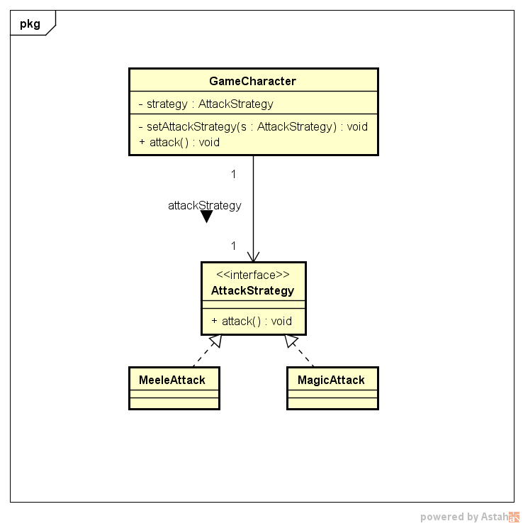
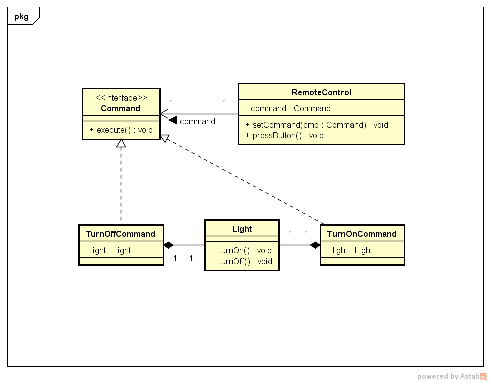

# Padrões de Projeto: Strategy e Command

## Descrição

Este repositório contém implementações em Java de dois padrões de projeto comportamentais: **Strategy** e **Command**. Os exemplos demonstram como aplicar esses padrões para promover flexibilidade, reutilização e baixo acoplamento em sistemas orientados a objetos.

---

## Padrão Strategy

O padrão Strategy define uma família de algoritmos, encapsula cada um deles e os torna intercambiáveis, permitindo que o algoritmo varie independentemente dos clientes que o utilizam.

- **Objetivo:** Permitir que diferentes estratégias (algoritmos) sejam selecionadas em tempo de execução.
- **Exemplo:** Personagens de jogo com diferentes estratégias de ataque.
- **Principais componentes:**
  - Interface `AttackStrategy`
  - Implementações concretas (`MagicAttack`, `MeeleAttack`)
  - Classe `GameCharacter` que usa uma `AttackStrategy`

### Diagrama UML Strategy
  

---

## Padrão Command

O padrão Command encapsula uma solicitação como um objeto, permitindo parametrizar clientes com diferentes solicitações e suportar operações como fila, log e desfazer.

- **Objetivo:** Desacoplar o objeto que invoca uma operação daquele que a executa.
- **Exemplo:** Controle remoto que liga/desliga uma luz através de comandos encapsulados.
- **Principais componentes:**
  - Interface `Command`
  - Comandos concretos (`TurnOnCommand`, `TurnOffCommand`)
  - Receptor (`Light`)
  - Invocador (`RemoteControl`)

### Diagrama UML Command
  

---

